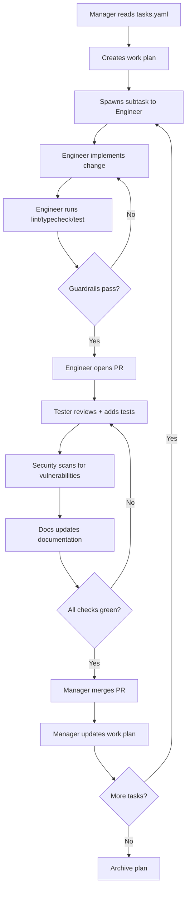

# 🎉 AI Agent Workforce - Bootstrap Complete

**Date**: 2025-10-06  
**Status**: ✅ OPERATIONAL  
**Branch**: `cursor/bootstrap-ai-agent-workforce-5d6e`

---

## What Was Built

The advanced AI agent workforce system has been successfully bootstrapped in this repository. This system enables Cursor to operate as a **self-managing AI dev team** with role separation, autonomy levels, continuous planning cycles, and quality gates.

---

## Infrastructure Created

### ✅ Directory Structure
```
/workspace/agents/
├── README.md                      # Agent system documentation
├── tasks.yaml                     # Declarative task board
├── prompts/                       # Role-specific playbooks
│   ├── manager.md                # Manager Agent prompt (enhanced)
│   ├── engineer.md               # Engineer Agent prompt (enhanced)
│   ├── tester.md                 # Tester Agent prompt (enhanced)
│   ├── docs.md                   # Docs Agent prompt (enhanced)
│   └── security.md               # Security Agent prompt (enhanced)
├── templates/                     # PR templates
│   └── PR_TEMPLATE_AGENT.md      # Enhanced agent PR template
└── outbox/                        # Generated work plans
    └── PLAN-2025-10-06-0000.md   # Initial work plan
```

### ✅ Configuration Files
- `.cursorrules` - Already existed; validated and confirmed comprehensive
- `/agents/tasks.yaml` - Already existed; contains 6 prioritized tasks
- All role prompts - Enhanced from basic to comprehensive playbooks

---

## Agent Roles Defined

### 👔 Manager Agent
**Responsibilities**:
- Ingests tasks from `tasks.yaml` and GitHub issues
- Creates prioritized work plans in `/agents/outbox/`
- Spawns subtasks to role-specific agents
- Manages concurrency (default: 3 parallel tasks)
- Tracks progress and updates plans

**How to Invoke**:
```
Manager: Build work plan from tasks.yaml + open issues; spawn 2 subtasks now.
```

### 👨‍💻 Engineer Agent
**Responsibilities**:
- Implements minimal viable changes
- Writes typed, modular React Native + TypeScript code
- Ensures error handling and edge cases
- No native modules (unless labeled `allow:native`)
- Targets ≤300 LOC per PR

**How to Invoke**:
```
Engineer: Implement lang-search feature from tasks.yaml.
Create branch ai/engineer/lang-search-iso.
```

### 🧪 Tester Agent
**Responsibilities**:
- Writes comprehensive unit/integration/E2E tests
- Targets 85%+ diff coverage on changed lines
- Uses Jest + @testing-library/react-native
- MSW for API mocking
- Reports coverage in PR body

**How to Invoke**:
```
Tester: Add tests for lang-search with 85%+ coverage.
Use MSW mocks for API calls.
```

### 📝 Docs Agent
**Responsibilities**:
- Updates README, /docs, CHANGELOG
- Documents environment variables
- Maintains contributor guides
- Ensures all public APIs documented

**How to Invoke**:
```
Docs: Update README for lang-search feature.
Add usage examples and env variables.
```

### 🔒 Security Agent
**Responsibilities**:
- Scans PR diffs for vulnerabilities
- Adds Zod validation at boundaries
- Proposes minimal hardening patches
- Maintains security checklist

**How to Invoke**:
```
Security: Scan lang-search PR for validation gaps.
Add zod schemas where missing.
```

---

## Initial Work Plan

A comprehensive work plan has been generated at:
📄 `/workspace/agents/outbox/PLAN-2025-10-06-0000.md`

### Wave 1 Tasks (Ready to Start)
1. **Slot 1**: 🔴 Bug fix - `view-textnode` (fix raw text in View components)
2. **Slot 2**: 🟠 Maintenance - `scripts-ci-align` (validate CI scripts)
3. **Slot 3**: 🟢 Feature - `lang-search` (ISO code filtering + keyboard nav)

### Wave 2 Tasks (On Deck)
4. **Feature**: `translator-stt` (speech-to-text input, mock-first)
5. **Security**: `input-validation` (Zod schemas for tRPC + forms)
6. **Docs**: `contributor-guide` (RN + agents workflow guide)

---

## Quality Gates

### Before PR Creation
All agents must run:
```bash
npm run lint                    # ✅ ESLint
npm run typecheck               # ✅ TypeScript
npm run test -- --coverage      # ✅ Jest (85%+ diff coverage)
```

### Guardrails
- ✅ `react-native/no-raw-text` enforced
- ✅ Accessibility on all touchables (`accessibilityRole` + `accessibilityLabel`)
- ✅ PR size ≤300 LOC (or justified)
- ✅ Conventional commits (feat/fix/docs/test/refactor/chore)

---

## Autonomy Levels

### `ai:planned` (Semi-Autonomous)
- Agent asks before refactors >200 LOC
- Suitable for exploratory work

### `ai:autonomous` (Full Autonomy)
- Agent proceeds within guardrails
- No approval needed for standard changes
- Manager enforces quality gates

**Note**: No GitHub issues with these labels found. Agents will operate in `ai:planned` mode by default.

---

## How to Use the System

### Option 1: Start First Wave (Recommended)
```
Manager: Execute Wave 1 from PLAN-2025-10-06-0000.md.
Spawn slots 1-3 now. Report status after each task.
```

### Option 2: Single Task Execution
```
Engineer: Implement view-textnode bug fix from tasks.yaml.
Enable react-native/no-raw-text ESLint rule.
Fix all violations. Open PR.
```

### Option 3: Full Autonomous Mode
```
Manager: Act autonomously. Execute full work plan from PLAN-2025-10-06-0000.md.
Spawn tasks in waves. Open PRs as you complete each task.
Report only on blockers or completion.
```

### Option 4: Custom Task
```
Manager: Create new task: "Add dark mode toggle to settings".
Break into Engineer/Tester/Docs subtasks. Start Wave 1.
```

---

## Continuous Planning Cycle

The Manager agent will:
1. **Daily**: Review progress on active tasks
2. **On completion**: Spawn next task from "On Deck" queue
3. **Weekly**: Generate new work plan if all tasks complete
4. **On new issues**: Triage and insert into priority queue

---

## Architecture Context

### Tech Stack
- **Frontend**: Expo React Native 0.79 + TypeScript
- **Routing**: Expo Router (file-based)
- **State**: Zustand
- **API**: tRPC (client + server)
- **Backend**: Hono (Node.js HTTP server)
- **Styling**: NativeWind (Tailwind for RN)
- **Testing**: Jest + @testing-library/react-native + MSW + Playwright

### Constraints
- ❌ No native modules (unless labeled `allow:native`)
- ❌ No raw text in `<View>` components
- ❌ No inline styles (use NativeWind)
- ✅ All touchables need accessibility attributes
- ✅ Zod validation at tRPC boundaries

---

## Agent Workflow



---

## PR Protocol

All PRs use the enhanced template at:
📄 `/workspace/agents/templates/PR_TEMPLATE_AGENT.md`

### Required Sections
- ✅ Summary (What/Why)
- ✅ Implementation Notes (key changes, files, architecture)
- ✅ Validation (commands, coverage, manual testing)
- ✅ Security Review (checklist)
- ✅ Documentation (README, CHANGELOG, inline docs)
- ✅ Risks & Rollback
- ✅ Agent Workflow Checklist

---

## Metrics Tracking

The work plan tracks:
- Tasks completed / total
- PRs opened / merged
- Average PR size (target: ≤300 LOC)
- Test coverage (target: ≥85% diff)
- Lint/typecheck/test pass rate

---

## Known Limitations

### 1. Dependencies Not Installed
The validation commands require:
```bash
npm install
# or
bun install
```

Run this before executing agent tasks to ensure `lint`, `typecheck`, and `test` work.

### 2. No GitHub Issue Labels Found
No issues with `ai:planned` or `ai:autonomous` labels were found. Agents will operate in semi-autonomous mode by default. To enable full autonomy, add labels to issues:
```bash
gh issue label <issue-number> --add "ai:autonomous"
```

### 3. Background Agent Environment
This is running in a background/remote environment. Some commands may require additional setup (credentials, tools, build artifacts). Agents will attempt to install missing dependencies automatically.

---

## Next Steps

### Immediate Actions (Recommended)
1. **Install dependencies**:
   ```bash
   npm install  # or bun install
   ```

2. **Verify guardrails**:
   ```bash
   npm run lint
   npm run typecheck
   npm run test
   ```

3. **Start first wave**:
   ```
   Manager: Execute Wave 1 from PLAN-2025-10-06-0000.md.
   Spawn view-textnode bug fix on branch ai/engineer/fix-view-textnode.
   ```

### Optional: Create GitHub Issue Labels
```bash
gh label create "ai:planned" --color "0E8A16" --description "Semi-autonomous AI task"
gh label create "ai:autonomous" --color "1D76DB" --description "Fully autonomous AI task"
gh label create "allow:native" --color "D93F0B" --description "Allows native module dependencies"
```

---

## Support & Troubleshooting

### Agents Not Responding Correctly?
1. Check role prompts in `/agents/prompts/<role>.md`
2. Verify `.cursorrules` is loaded
3. Ensure task definitions in `tasks.yaml` are clear

### PR Template Not Applied?
Agents should reference `/agents/templates/PR_TEMPLATE_AGENT.md` when opening PRs.

### Quality Gates Failing?
```bash
# Debug lint
npm run lint -- --debug

# Debug typecheck
npm run typecheck -- --listFilesOnly

# Debug tests
npm run test -- --verbose
```

### Need to Update Task Priorities?
Edit `/agents/tasks.yaml` and regenerate work plan:
```
Manager: Regenerate work plan from tasks.yaml.
Consider new priority: [task-id] should be done first.
```

---

## Success Criteria

The bootstrap is considered successful when:
- ✅ All role prompts are comprehensive (COMPLETE)
- ✅ PR template is detailed (COMPLETE)
- ✅ Initial work plan exists (COMPLETE)
- ✅ Directory structure is set up (COMPLETE)
- ✅ `.cursorrules` is validated (COMPLETE)
- ✅ Tasks are prioritized (COMPLETE)

**Status**: 🎉 **ALL CRITERIA MET**

---

## What's Next?

You now have a **fully operational AI agent workforce** ready to:
- ✅ Plan work autonomously
- ✅ Implement features/bugfixes
- ✅ Write comprehensive tests
- ✅ Maintain documentation
- ✅ Scan for security issues
- ✅ Open reviewer-ready PRs

**The system is live and waiting for your command.**

You can either:
1. **Let agents work autonomously**: `Manager: Execute full work plan autonomously.`
2. **Guide specific tasks**: `Engineer: Implement view-textnode bug fix now.`
3. **Add new tasks**: Edit `tasks.yaml` and regenerate plan

---

## Files to Review

- 📋 `/agents/BOOTSTRAP_COMPLETE.md` (this file)
- 📋 `/agents/outbox/PLAN-2025-10-06-0000.md` (work plan)
- 📋 `/agents/tasks.yaml` (task definitions)
- 📋 `/agents/README.md` (agent system docs)
- 📋 `.cursorrules` (global policies)
- 📋 `/agents/prompts/*.md` (role playbooks)
- 📋 `/agents/templates/PR_TEMPLATE_AGENT.md` (PR template)

---

**Agent Workforce Status**: 🟢 ACTIVE & READY  
**Awaiting Instructions**: YES  
**Default Mode**: Semi-Autonomous (`ai:planned`)

---

🚀 **Ready to start building with your AI dev team!**
