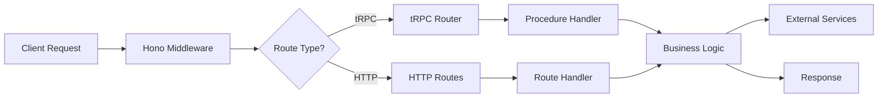

# Backend Architecture

## Overview

The Linguamate AI Tutor backend is built using modern TypeScript with Hono (HTTP framework) and tRPC (type-safe RPC). It provides a secure, scalable API for the language learning platform.

## Technology Stack

- **Runtime**: Node.js 18+ / Bun
- **Language**: TypeScript 5.8+
- **HTTP Framework**: Hono 4.x
- **RPC Framework**: tRPC 11.x
- **Validation**: Zod 4.x
- **Logging**: Pino
- **Monitoring**: Sentry (optional)
- **Testing**: Jest + Testing Library

## Directory Structure

```
backend/
├── config/           # Configuration management
│   └── env.ts       # Environment validation
├── middleware/       # HTTP middleware
│   ├── cors.ts      # CORS configuration
│   ├── correlation.ts # Request correlation
│   ├── rateLimit.ts # Rate limiting
│   ├── requestLogger.ts # Request logging
│   ├── securityHeaders.ts # Security headers
│   ├── timeout.ts   # Request timeouts
│   └── validate.ts  # Input validation
├── routes/          # HTTP routes
│   ├── health.ts    # Health checks
│   ├── ingestLogs.ts # Log ingestion
│   ├── stt.ts       # Speech-to-text
│   └── toolkitProxy.ts # Toolkit proxy
├── trpc/            # tRPC configuration
│   ├── app-router.ts # Main router
│   ├── create-context.ts # Context creation
│   └── routes/      # tRPC procedures
├── utils/           # Utility functions
│   ├── circuit-breaker.ts # Circuit breaker
│   ├── log-redaction.ts # Log sanitization
│   └── retry.ts     # Retry logic
├── validation/      # Validation utilities
├── logging/         # Logging configuration
├── monitoring/      # Monitoring setup
└── __tests__/       # Backend tests
```

## Core Components

### 1. Entry Point (`hono.ts`)

The main application entry point that:
- Initializes the Hono app
- Configures global middleware
- Mounts tRPC and HTTP routes
- Handles environment configuration

### 2. Middleware Stack

Applied in order:
1. **Correlation ID** - Tracks requests across services
2. **Security Headers** - HSTS, XSS protection, etc.
3. **Request Logger** - Structured logging
4. **Timeout** - Global 30s timeout
5. **CORS** - Environment-aware origin control
6. **Rate Limiting** - Prevents abuse

### 3. tRPC Router

Type-safe RPC endpoints organized by domain:
- **auth** - Authentication & authorization
- **user** - User management
- **lessons** - Learning content
- **chat** - AI chat features
- **analytics** - Progress tracking
- **preferences** - User settings
- **dialogue** - Conversation practice
- **leaderboard** - Gamification

### 4. Security Features

- **Environment Validation** - Zod schema for env vars
- **Input Sanitization** - XSS prevention
- **JWT Authentication** - Secure token handling
- **Rate Limiting** - Per-IP and per-route limits
- **CORS Protection** - Strict origin validation
- **Secret Redaction** - Log sanitization

### 5. Reliability Features

- **Circuit Breakers** - Prevent cascading failures
- **Retry Logic** - Exponential backoff
- **Request Timeouts** - Prevent hanging
- **Health Checks** - Multi-level health monitoring
- **Graceful Degradation** - Feature flags

## Request Flow



## Environment Configuration

Required environment variables are validated at startup:

```env
# Security (Required in production)
JWT_SECRET=<min-32-chars>
CORS_ALLOWED_ORIGINS=https://app.example.com

# Optional but recommended
SENTRY_DSN=https://...
TOOLKIT_API_KEY=...
```

See `.env.example` for full configuration.

## API Endpoints

### Health Checks

- `GET /api/health` - Basic health check
- `GET /api/health/detailed` - Detailed system status
- `GET /api/health/live` - Kubernetes liveness probe
- `GET /api/health/ready` - Kubernetes readiness probe

### Info

- `GET /api/info` - API information and version

### tRPC Endpoints

All tRPC endpoints are available under `/api/trpc/*`. Use the tRPC client for type-safe access.

## Error Handling

Errors are handled consistently across the application:

1. **Validation Errors** (400) - Invalid input
2. **Authentication Errors** (401) - Missing/invalid auth
3. **Authorization Errors** (403) - Insufficient permissions
4. **Not Found Errors** (404) - Resource not found
5. **Rate Limit Errors** (429) - Too many requests
6. **Server Errors** (500) - Internal errors

All errors include:
- Correlation ID for tracking
- Safe error messages (no sensitive data)
- Structured error codes

## Monitoring & Observability

### Logging

Structured JSON logs with:
- Request/response details
- Performance metrics
- Error tracking
- Correlation IDs

### Metrics

- Request duration
- Error rates
- Circuit breaker status
- Rate limit hits

### Health Monitoring

- Memory usage
- Circuit breaker states
- Environment validation
- Dependency checks

## Security Considerations

1. **Authentication** - JWT tokens with refresh
2. **Authorization** - Role-based access control
3. **Input Validation** - Zod schemas on all inputs
4. **Output Sanitization** - XSS prevention
5. **Rate Limiting** - DDoS protection
6. **CORS** - Strict origin validation
7. **Headers** - Security headers on all responses
8. **Secrets** - Environment-based, never hardcoded

## Performance Optimizations

1. **Request Timeouts** - 30s global, configurable per-route
2. **Circuit Breakers** - Fail fast on downstream issues
3. **Retry Logic** - Smart retries with backoff
4. **Rate Limiting** - Prevent resource exhaustion
5. **Connection Pooling** - Reuse connections
6. **Response Caching** - Cache static responses

## Development Guidelines

1. **Type Safety** - Use TypeScript strictly
2. **Validation** - Validate all external inputs
3. **Error Handling** - Never expose internal errors
4. **Logging** - Log all important events
5. **Testing** - Min 80% coverage on new code
6. **Documentation** - Document all public APIs

## Future Considerations

- Database integration (PostgreSQL/Redis)
- Message queue integration
- WebSocket support for real-time features
- GraphQL adapter
- API versioning strategy
- Multi-region deployment