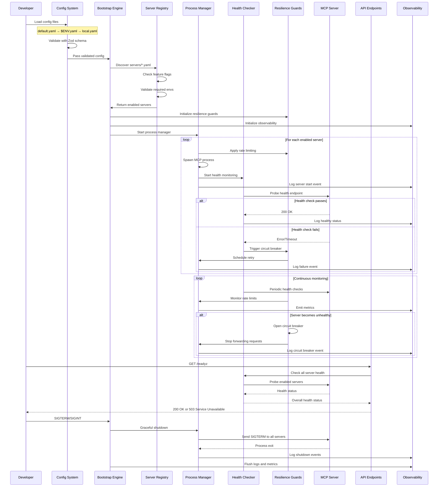

# Omni-MCP Data Flow & Process Lifecycle

## Process Lifecycle Management

### 🚀 **Startup Sequence**

1. **Config Loading**: Load and validate configuration files
2. **Schema Validation**: Ensure all configs pass Zod validation
3. **Server Discovery**: Scan `/servers/*.yaml` for enabled servers
4. **Environment Check**: Verify required environment variables
5. **Guard Initialization**: Set up rate limiting, circuit breakers
6. **Process Spawning**: Start MCP server processes
7. **Health Monitoring**: Begin continuous health checks
8. **Observability Setup**: Initialize logging, metrics, tracing

### 🔄 **Runtime Monitoring**

- **Health Checks**: Periodic stdio/HTTP probes (configurable interval)
- **Rate Limiting**: Track RPS and burst limits per server
- **Circuit Breaker**: Monitor failure rates and trip thresholds
- **Process Management**: Handle crashes, restarts, and graceful shutdowns
- **Metrics Collection**: Emit Prometheus metrics for monitoring

### 🛑 **Shutdown Sequence**

1. **Signal Handling**: Catch SIGTERM/SIGINT signals
2. **Graceful Shutdown**: Send SIGTERM to all MCP processes
3. **Health Drain**: Wait for processes to exit gracefully
4. **Force Kill**: SIGKILL remaining processes after timeout
5. **Cleanup**: Flush logs, close connections, exit cleanly

## Error Handling & Recovery

### 🔧 **Retry Logic**
- **Exponential Backoff**: 500ms → 1s → 2s → 5s → 10s
- **Jitter**: Add random delay to prevent thundering herd
- **Max Retries**: Configurable per server (default: 5)
- **Circuit Breaker**: Temporary disable after repeated failures

### 🚨 **Failure Scenarios**
- **Process Crash**: Automatic restart with backoff
- **Health Check Failure**: Mark unhealthy, stop forwarding
- **Rate Limit Exceeded**: Queue requests or return 429
- **Timeout**: Cancel operation, log timeout event
- **Configuration Error**: Fail fast with clear error message

### 📊 **Observability Events**
- **Server Start**: Process spawned successfully
- **Server Stop**: Process exited (normal or error)
- **Health Change**: Server health status changed
- **Circuit Breaker**: Circuit opened/closed
- **Rate Limit**: Rate limit exceeded
- **Retry**: Operation retried after failure
- **Timeout**: Operation timed out
- **Config Error**: Configuration validation failed