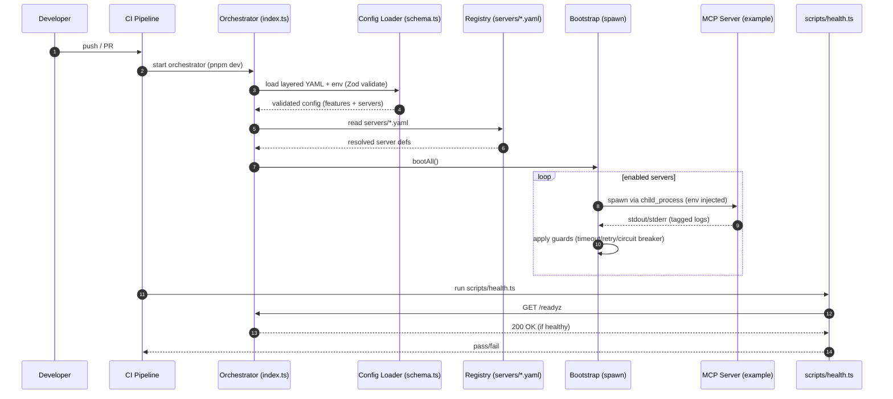
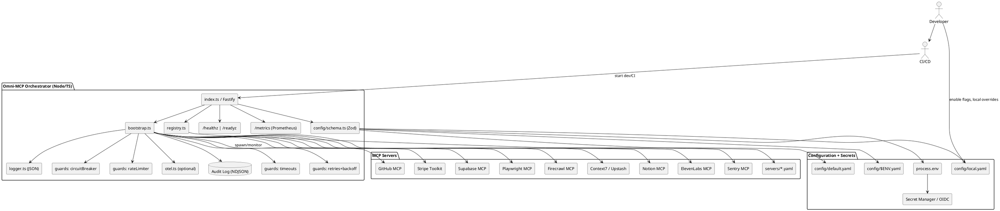

# Omni-MCP Framework Architecture Diagrams

## Component Architecture (C4-style)

```mermaid
flowchart LR
  subgraph DevEnv[Developer Environment]
    Dev[Engineer]
    CI[GitHub Actions CI/CD]
  end

  subgraph Orchestrator[Omni-MCP Orchestrator (Node/TS)]
    IDX[Index.ts / Fastify]
    BOOT[bootstrap.ts]
    REG[registry.ts]
    CFG[config/schema.ts (Zod + YAML)]
    G1[guards/timeouts]
    G2[guards/retries+backoff]
    G3[guards/circuitBreaker]
    G4[guards/rateLimiter]
    LOG[observability/logger.ts (JSON)]
    OTEL[observability/otel.ts (opt)]
    METRICS[/metrics (Prometheus)/]
    HEALTH[/healthz & /readyz/]
    AUDIT[(Audit Log NDJSON)]
  end

  subgraph Config[Configuration + Secrets]
    Y1[config/default.yaml]
    Y2[config/$ENV.yaml]
    Y3[config/local.yaml (gitignored)]
    ENV[(process.env)]
    SECRETS[(Secret Manager / OIDC)]
  end

  subgraph Servers[Registered MCP Servers]
    S0[servers/*.yaml (declarative)]
    S1[(GitHub MCP)]
    S2[(Stripe Toolkit)]
    S3[(Supabase MCP)]
    S4[(Playwright MCP)]
    S5[(Firecrawl MCP)]
    S6[(Context7 / Upstash)]
    S7[(Notion MCP)]
    S8[(ElevenLabs MCP)]
    S9[(Sentry MCP)]
    Sx[… others]]
  end

  Dev -->|enable flags, edit YAML| Config
  Dev --> CI
  CI --> IDX

  IDX --> BOOT
  IDX --> HEALTH
  IDX --> METRICS

  BOOT --> REG
  REG --> S0
  REG --> CFG
  CFG --> Y1
  CFG --> Y2
  CFG --> Y3
  CFG --> ENV
  ENV --> SECRETS

  BOOT -->|spawn/monitor via child_process| S1
  BOOT -->|spawn/monitor| S2
  BOOT -->|spawn/monitor| S3
  BOOT -->|spawn/monitor| S4
  BOOT -->|spawn/monitor| S5
  BOOT -->|spawn/monitor| S6
  BOOT -->|spawn/monitor| S7
  BOOT -->|spawn/monitor| S8
  BOOT -->|spawn/monitor| S9

  BOOT --> G1
  BOOT --> G2
  BOOT --> G3
  BOOT --> G4

  BOOT --> LOG
  BOOT --> OTEL
  BOOT --> AUDIT

  classDef svc fill:#0ea5e9,stroke:#0b7285,color:#fff
  classDef cfg fill:#fde68a,stroke:#ca8a04,color:#222
  classDef orch fill:#c7d2fe,stroke:#3730a3,color:#111
  classDef guard fill:#e2e8f0,stroke:#475569
  classDef obs fill:#bbf7d0,stroke:#16a34a
  class Orchestrator orch
  class CFG,Y1,Y2,Y3,ENV,SECRETS,S0 cfg
  class G1,G2,G3,G4 guard
  class LOG,OTEL,METRICS,HEALTH,AUDIT obs
  class S1,S2,S3,S4,S5,S6,S7,S8,S9 svc
```

## Boot & Health Sequence



## PlantUML Component View



## Usage Instructions

### Mermaid Diagrams
- **Markdown**: Drop code blocks into `.md` files
- **GitHub/GitLab**: Native rendering support
- **VS Code**: Use Mermaid extension for preview

### PlantUML Diagrams
- **VS Code**: PlantUML extension
- **CLI**: `java -jar plantuml.jar diagram.puml`
- **Online**: PlantUML server
- **CI**: Generate images in build pipeline